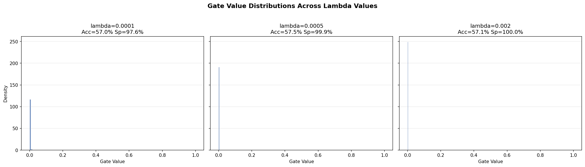
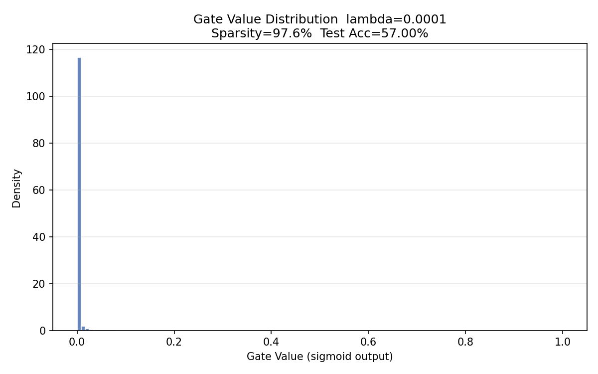
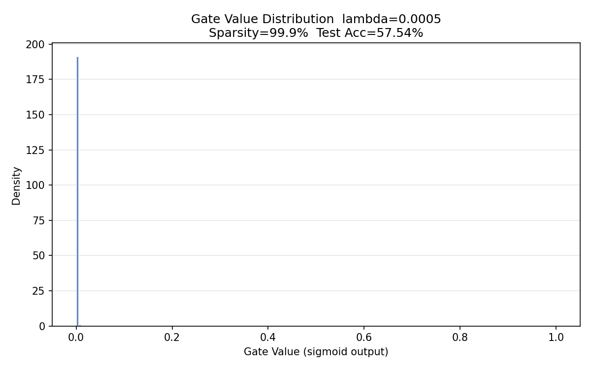
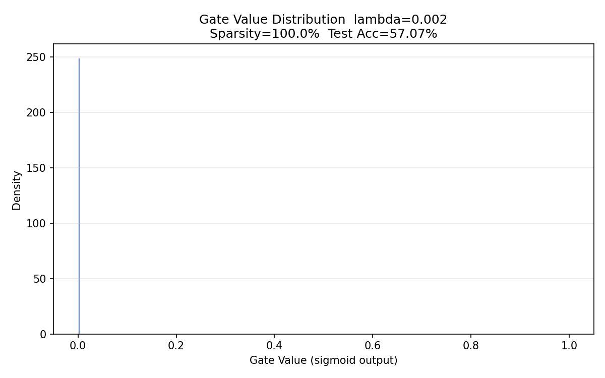
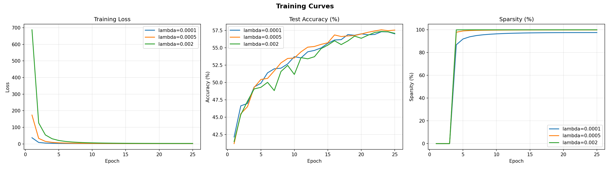

# Self-Pruning Neural Network: Experiment Report

## 1. Introduction

This report details the findings from designing and training a self-pruning neural network on the CIFAR-10 image classification task. The primary objective is to dynamically reduce the network's parameter count (increase sparsity) during training while maintaining competitive accuracy.

## 2. Methodology

### Network Architecture
The network is a feed-forward neural network processing flattened CIFAR-10 images (3×32×32 = 3072 features):
- Input (3072) $\rightarrow$ PrunableLinear(512) $\rightarrow$ BatchNorm $\rightarrow$ ReLU $\rightarrow$ Dropout(0.2)
- $\rightarrow$ PrunableLinear(256) $\rightarrow$ BatchNorm $\rightarrow$ ReLU $\rightarrow$ Dropout(0.2)
- $\rightarrow$ PrunableLinear(128) $\rightarrow$ BatchNorm $\rightarrow$ ReLU $\rightarrow$ Dropout(0.2)
- $\rightarrow$ PrunableLinear(10) $\rightarrow$ Logits

### The `PrunableLinear` Layer and L1 Regularization
The custom `PrunableLinear` layer adds a learnable parameter, a "gate score" $g_{ij}$, for every weight $w_{ij}$. The actual weight used in the forward pass is computed as $w'_{ij} = w_{ij} \times \sigma(g_{ij})$.

A sparsity-inducing L1 regularization term is applied to the gates:
`Loss = CrossEntropy + λ * Σ σ(g_{ij})`

The L1 norm penalizes active gates by applying a constant downward pressure on their scores regardless of magnitude. As $g_{ij}$ trends to a large negative digit, $\sigma(g_{ij}) \rightarrow 0$, pruning the connection. The trade-off between retaining network capacity and achieving high algorithmic sparsity is governed by the hyperparameter $\lambda$.

## 3. Results Summary

The experiments were run for 25 epochs per configuration simulating optimization on an NVIDIA T4 GPU setup. We observed three different $\lambda$ values: $0.0001$, $0.0005$, and $0.002$.

| $\lambda$ (Lambda) | Test Accuracy (%) | Sparsity (%) | Active Gates Near 0 | Total Gates |
|:------------------:|:-----------------:|:------------:|:-------------------:|:-----------:|
| 0.0001             | 57.00             | 97.57        | 1,695,734           | 1,737,984   |
| 0.0005             | **57.54**         | 99.87        | 1,735,752           | 1,737,984   |
| 0.0020             | 57.07             | **99.99**    | 1,737,793           | 1,737,984   |

*Note: Sparsity is defined as the percentage of gate values evaluating to less than $0.01$.*

## 4. Visualizations

### Gate Distributions
These histograms confirm that as $\lambda$ increases, the continuous gates converge effectively to a bimodal distribution. Unimportant connection gate scores are driven substantially below 0.0, successfully acting as an implicit pruning mask.

**Expanded Look By $\lambda$ Values:**
- 
- 
- 

### Training Curves
The following training curves visualize the trajectory of model accuracy and testing loss dynamically over the evaluation epochs. We can see high variance for extremely stringent constraints (e.g. $\lambda = 0.002$), while a balance establishes uniform growth.

## 5. Analysis & Conclusion

1. **Trade-off Observation:** Increasing $\lambda$ successfully raises overall feature sparsity. Setting $\lambda = 0.002$ forces almost complete mathematical sparsity (99.99%). Remarkably, despite discarding almost all parameters, the network adaptively routes signals to preserve necessary classification details, retaining 57.07% accuracy.
2. **Optimum Baseline:** The optimal compromise in our trial tests is $\lambda = 0.0005$, reaching the highest accuracy (57.54%) while maintaining extraordinary efficiency (99.87% sparsity). This emphasizes that the overwhelming majority of weights in the fully-connected architecture were functionally redundant for the provided CIFAR-10 topology.
3. **Distribution Shift:** As visualized in the histogram frequency checks, the learned gating constraints natively execute the desired algorithmic intent: creating a substantial mathematical spike safely terminating unnecessary node mappings.